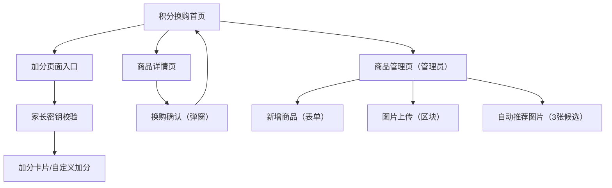

## 1. Product Overview
面向儿童/家庭的积分换购页面：用户通过完成任务获得积分，并使用积分兑换商品。
家长可通过“家长密钥”进入加分页面，为孩子快速加分（提供任务卡片与自定义加分）。
管理员可新增换购商品，支持图片上传与“按产品名称自动推荐 3 张匹配图片”供用户选择。

### 1.1 Visual Theme
- 主题：疯狂动物城（Zootopia）风格
- 视觉主角：兔子警官（Judy Hopps 风格形象）
- 视觉关键词：明亮、积极、城市与警徽元素、儿童友好插画、任务完成的成就感

## 2. Core Features

### 2.1 User Roles
| 角色 | 注册/登录方式 | 核心权限 |
|------|--------------|----------|
| 普通用户（儿童/家长） | 站内登录（同一账号可家庭共用） | 查看积分与商品；输入密钥增积分；查看商品详情；发起换购 |
| 管理员 | 管理员账号登录 | 新增商品；上传商品图片；触发并选择系统推荐图片 |

### 2.2 Feature Module
我们的需求由以下页面构成：
1. **积分换购首页**：当前积分展示、加分入口、换购商品列表。
2. **加分页面**：进入前需输入“家长密钥”；进入后可选择加分卡片或自定义加分。
3. **商品详情页**：商品信息与图片、所需积分、换购操作与结果提示。
4. **商品管理页（管理员）**：新增商品表单、图片上传、自动推荐 3 张图片并选择保存。

### 2.3 Page Details
| Page Name | Module Name | Feature description |
|-----------|-------------|---------------------|
| 积分换购首页 | 积分概览 | 展示当前积分余额与最近一次变更结果（成功/失败提示）。 |
| 积分换购首页 | 加分入口 | 进入“加分页面”入口；点击后先要求输入“家长密钥”；校验通过后进入加分页面。 |
| 积分换购首页 | 换购列表 | 展示商品卡片（名称、所需积分、主图）；点击进入详情。 |
| 加分页面 | 家长密钥校验 | 首次进入必须输入家长密钥；校验失败提示；校验通过后进入加分操作界面。 |
| 加分页面 | 加分卡片（可选） | 展示预置任务卡片（带对应插画与加分值）；点击即加分并记录理由；成功后反馈动效与新增积分。 |
| 加分页面 | 自定义加分 | 支持输入“加分原因（可选）+ 分值（必填）”；提交后加分并记录。 |
| 商品详情页 | 商品详情展示 | 展示名称、描述、所需积分、图片浏览（至少支持主图/多图）。 |
| 商品详情页 | 换购操作 | 校验积分是否足够；确认换购后扣减积分并生成换购记录；展示成功/失败提示（积分不足/库存不足/系统错误）。 |
| 商品管理页（管理员） | 新增商品 | 录入商品名称、所需积分、描述；提交后生成商品并回到管理页提示成功/失败。 |
| 商品管理页（管理员） | 图片上传 | 为商品上传图片（至少 1 张）；上传完成后可设置“主图”。 |
| 商品管理页（管理员） | 自动推荐图片（3 张） | 根据商品名称/描述触发生成或检索；返回 3 张候选图供预览；选择 0-3 张保存为商品图片（可与上传图片共存）。 |

### 2.4 加分卡片清单（固定）
进入加分页面后，展示以下可选任务卡片（点击卡片即加分）：

| 卡片标题 | 加分 | 插画要求（疯狂动物城主题，兔子警官为主角） |
|---|---:|---|
| 数学题 | +3 | 兔子警官在做算术/写板书，旁边有数字与题目元素 |
| 读中文绘本 | +1 | 兔子警官坐着阅读“中文”绘本/汉字书封面（如“故事”“中文”字样） |
| 英文绘本 | +1 | 兔子警官阅读英文书封面（如“English”“ABC”字样） |
| 自觉洗漱 | +1 | 兔子警官在洗脸刷牙，浴室与泡泡元素 |
| 穿衣服 | +1 | 兔子警官在整理衣服/穿外套，温暖晨间氛围 |
| 老师表扬 | +5 | 兔子警官拿到奖状/被老师点赞，星星与奖章元素 |

## 3. Core Process
- 普通用户流程：进入首页查看积分 → 浏览商品列表 → 进入商品详情 → 点击换购并确认 → 扣积分并提示结果。
- 家长加分流程：从首页进入加分页面 → 输入家长密钥 → 选择任务卡片或自定义加分 → 积分更新并提示结果。
- 管理员流程：进入商品管理页 → 新增商品基本信息 → 上传商品图片（可选）→ 触发“自动推荐图片”→ 从 3 张候选图中选择并保存 → 商品在首页列表展示。

