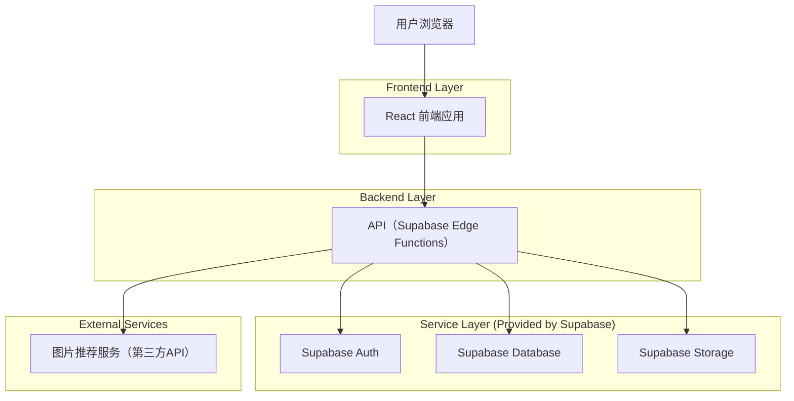
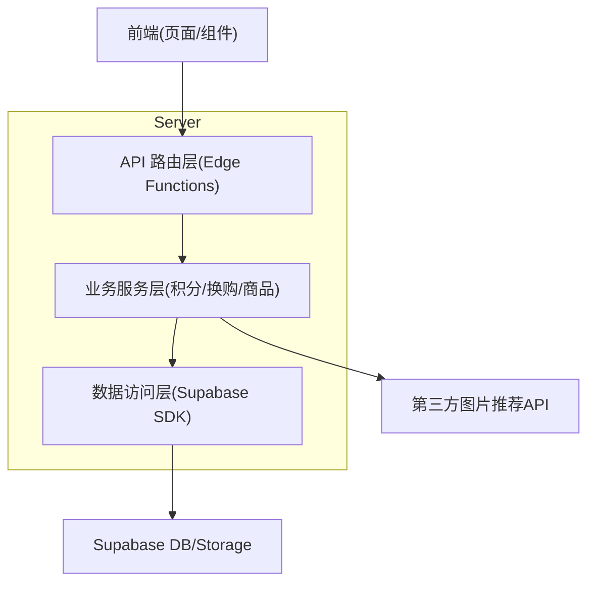
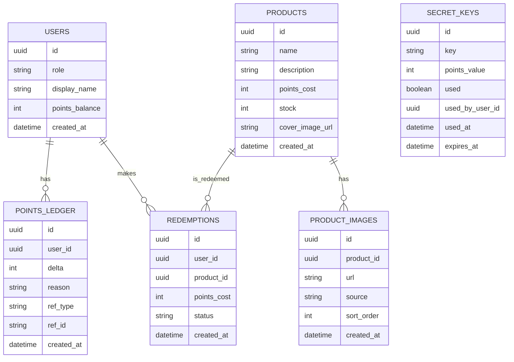

## 1.Architecture design


## 2.Technology Description
- Frontend: React@18 + vite + tailwindcss@3
- Backend: Supabase Edge Functions（承载业务 API 与鉴权校验）
- Database: Supabase (PostgreSQL)
- Storage: Supabase Storage（商品图片、推荐图片落库前的临时/正式存储）

### 2.1 UI Theme Notes
- 主题：疯狂动物城风格（主角兔子警官）
- 任务卡片插画：默认随前端静态资源发布（保证可用与稳定）；也可支持“后台配置插画 URL”进行替换
- 版权合规提示：若用于公开发布或商业用途，建议使用“原创插画（疯狂动物城风格灵感）”避免直接使用电影官方素材

## 3.Route definitions
| Route | Purpose |
|-------|---------|
| / | 积分换购首页：积分展示、加分入口、商品列表 |
| /points | 加分页面：输入家长密钥后可用卡片/自定义加分 |
| /product/:id | 商品详情页：展示与换购 |
| /admin/products | 商品管理页：新增商品、图片上传、自动推荐图片 |

## 4.API definitions (If it includes backend services)
### 4.1 Core Types（TypeScript）
```ts
export type UserRole = "user" | "admin";

export type Product = {
  id: string;
  name: string;
  description: string;
  points_cost: number;
  cover_image_url?: string;
  image_urls: string[];
  created_at: string;
};

export type RedeemRequest = { product_id: string };
export type RedeemResult = { ok: boolean; message?: string; new_points_balance?: number };

export type UnlockParentRequest = { parent_secret: string };
export type UnlockParentResult = { ok: boolean; message?: string; unlock_token?: string };

export type AddPointsRequest = {
  unlock_token: string;
  delta: number;
  reason: string;
};

export type AddPointsResult = { ok: boolean; message?: string; new_points_balance?: number };

export type RecommendImagesRequest = { product_name: string; product_description?: string };
export type RecommendImagesResult = { ok: boolean; images: { url: string; provider_ref?: string }[]; message?: string };
```

### 4.2 Core API
- 获取商品列表
  - `GET /api/products`
- 获取商品详情
  - `GET /api/products/:id`
- 密钥增积分
- 家长密钥解锁加分页面
  - `POST /api/points/unlock`
  - Body: `UnlockParentRequest`
  - Resp: `UnlockParentResult`
- 加分（卡片/自定义）
  - `POST /api/points/add`
  - Body: `AddPointsRequest`
  - Resp: `AddPointsResult`
- 发起换购
  - `POST /api/redemptions`
  - Body: `RedeemRequest`
  - Resp: `RedeemResult`
- 管理员新增商品
  - `POST /api/admin/products`
  - Body: `{ name: string; description: string; points_cost: number }`
- 管理员上传商品图片（多段上传或直传签名任选其一）
  - `POST /api/admin/products/:id/images/upload`
- 管理员获取自动推荐 3 张候选图片
  - `POST /api/admin/products/:id/images/recommend`
  - Body: `RecommendImagesRequest`
  - Resp: `RecommendImagesResult`（固定返回 3 张候选图）

## 5.Server architecture diagram (If it includes backend services)


## 6.Data model(if applicable)
### 6.1 Data model definition


### 6.2 Data Definition Language
> 说明：避免物理外键约束，使用逻辑外键字段（user_id/product_id）。

Users 扩展表（app_users）
```sql
CREATE TABLE app_users (
  id UUID PRIMARY KEY,
  role VARCHAR(10) NOT NULL DEFAULT 'user' CHECK (role IN ('user','admin')),
  display_name VARCHAR(100),
  points_balance INTEGER NOT NULL DEFAULT 0,
  created_at TIMESTAMPTZ NOT NULL DEFAULT NOW()
);

GRANT SELECT ON app_users TO anon;
GRANT ALL PRIVILEGES ON app_users TO authenticated;
```

密钥表（secret_keys）
```sql
CREATE TABLE secret_keys (
  id UUID PRIMARY KEY DEFAULT gen_random_uuid(),
  key VARCHAR(64) UNIQUE NOT NULL,
  points_value INTEGER NOT NULL,
  used BOOLEAN NOT NULL DEFAULT FALSE,
  used_by_user_id UUID,
  used_at TIMESTAMPTZ,
  expires_at TIMESTAMPTZ,
  created_at TIMESTAMPTZ NOT NULL DEFAULT NOW()
);

GRANT SELECT ON secret_keys TO anon;
GRANT ALL PRIVILEGES ON secret_keys TO authenticated;
```

商品表（products）
```sql
CREATE TABLE products (
  id UUID PRIMARY KEY DEFAULT gen_random_uuid(),
  name VARCHAR(120) NOT NULL,
  description TEXT,
  points_cost INTEGER NOT NULL,
  stock INTEGER NOT NULL DEFAULT 0,
  cover_image_url TEXT,
  created_at TIMESTAMPTZ NOT NULL DEFAULT NOW()
);

GRANT SELECT ON products TO anon;
GRANT ALL PRIVILEGES ON products TO authenticated;
```

商品图片表（product_images）
```sql
CREATE TABLE product_images (
  id UUID PRIMARY KEY DEFAULT gen_random_uuid(),
  product_id UUID NOT NULL,
  url TEXT NOT NULL,
  source VARCHAR(20) NOT NULL DEFAULT 'upload' CHECK (source IN ('upload','recommend')),
  sort_order INTEGER NOT NULL DEFAULT 0,
  created_at TIMESTAMPTZ NOT NULL DEFAULT NOW()
);

GRANT SELECT ON product_images TO anon;
GRANT ALL PRIVILEGES ON product_images TO authenticated;
```

换购记录表（redemptions）
```sql
CREATE TABLE redemptions (
  id UUID PRIMARY KEY DEFAULT gen_random_uuid(),
  user_id UUID NOT NULL,
  product_id UUID NOT NULL,
  points_cost INTEGER NOT NULL,
  status VARCHAR(20) NOT NULL DEFAULT 'success' CHECK (status IN ('success','failed')),
  created_at TIMESTAMPTZ NOT NULL DEFAULT NOW()
);

GRANT SELECT ON redemptions TO anon;
GRANT ALL PRIVILEGES ON redemptions TO authenticated;
```

积分流水表（points_ledger）
```sql
CREATE TABLE points_ledger (
  id UUID PRIMARY KEY DEFAULT gen_random_uuid(),
  user_id UUID NOT NULL,
  delta INTEGER NOT NULL,
  reason VARCHAR(50) NOT NULL,
  ref_type VARCHAR(30),
  ref_id UUID,
  created_at TIMESTAMPTZ NOT NULL DEFAULT NOW()
);

CREATE INDEX idx_points_ledger_user_id_created_at ON points_ledger(user_id, created_at DESC);

GRANT SELECT ON points_ledger TO anon;
GRANT ALL PRIVILEGES ON points_ledger TO authenticated;
```
